# WA_Projekt

## Backend

In das Verzeichnis backend wechseln und den Befehl zum Starten eingeben:

```
./mvnw quarkus:dev
```

- Quarkus Port: ``` http://localhost:8080 ```
- Swagger UI: ``` http://localhost:8080/api/q/swagger-ui ```

- Keycloak Port: ``` http://localhost:9090 ```

## Frontend

In das Verzeichnis frontend_ionic wechseln und den Befehl zum Starten eingeben:

```
ionic serve
```

oder

```
npm start
```

## Zugangsdaten zum Testen

### Admin Account mit Admin-Rechten
- username:
`admin`

- passwort:
`admin`

### Test Account mit User-Rechten
- username:
`testuser`

- passwort:
`admin`

## Screenshots

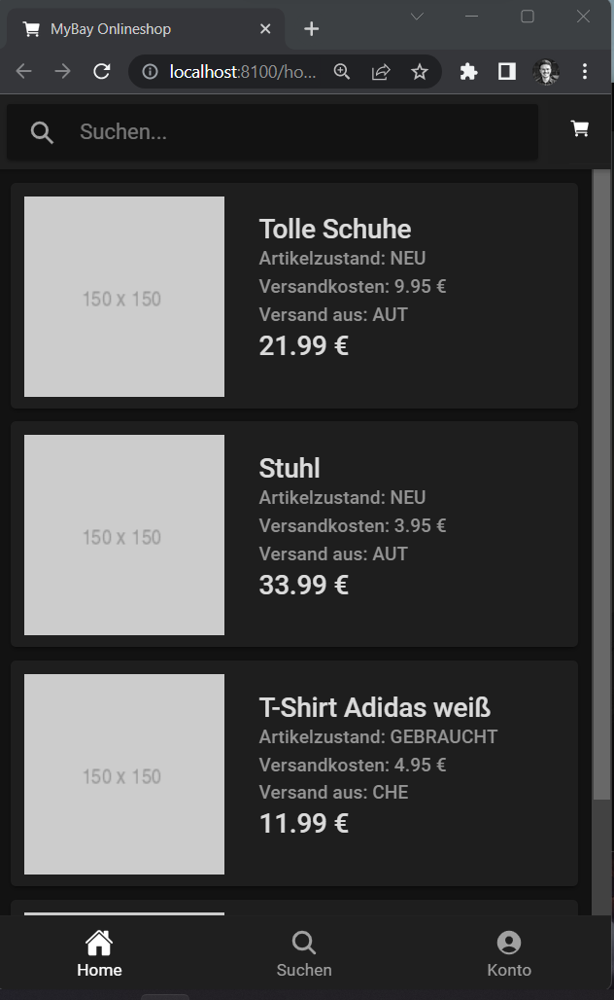
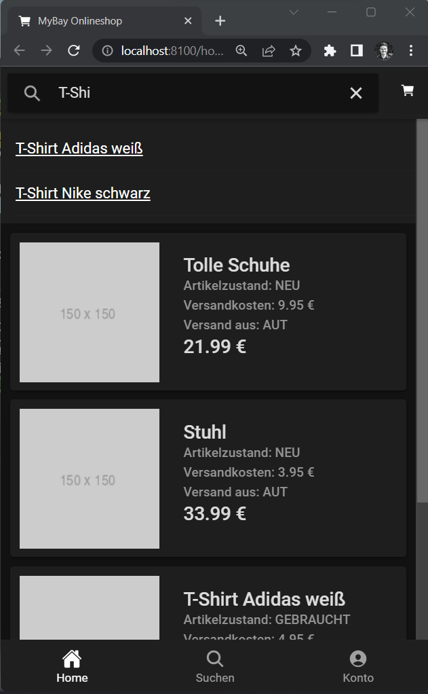
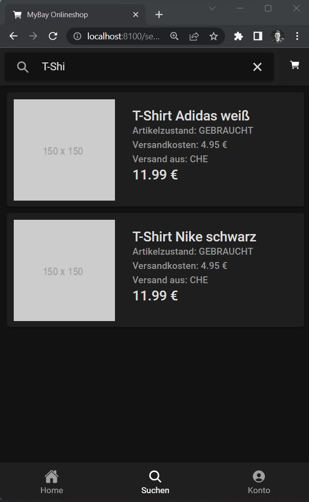
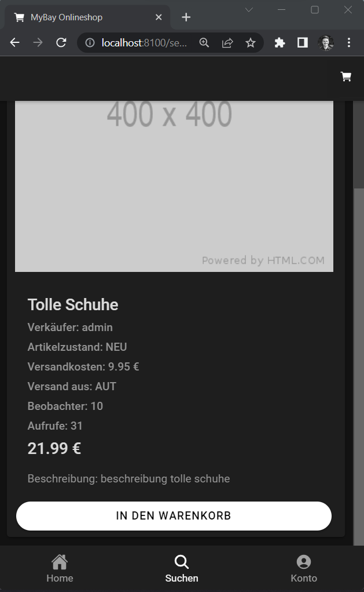
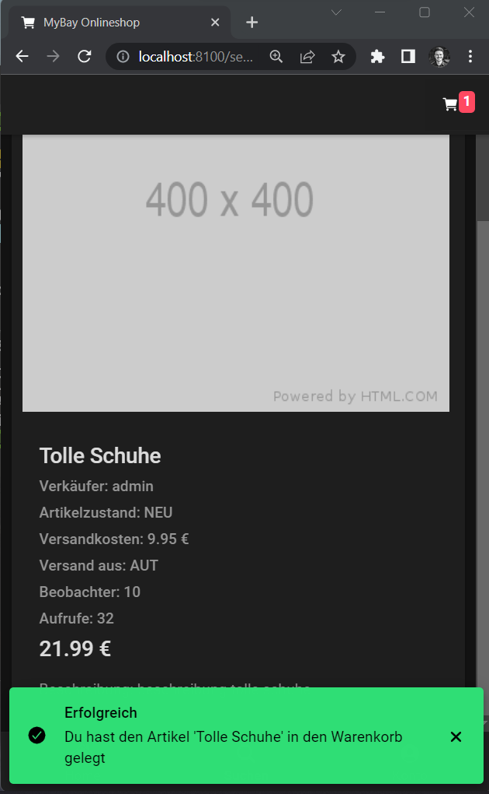
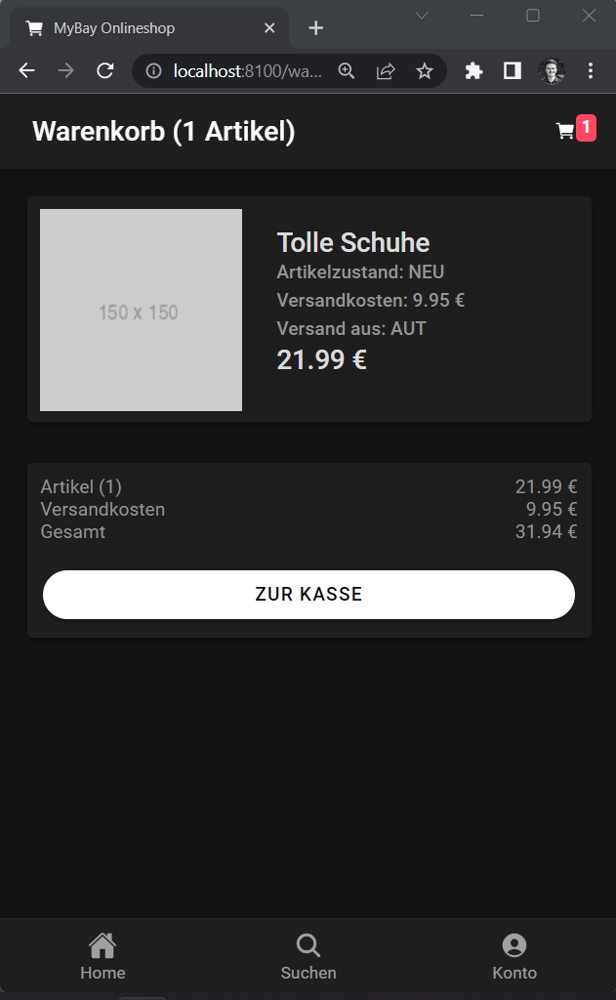
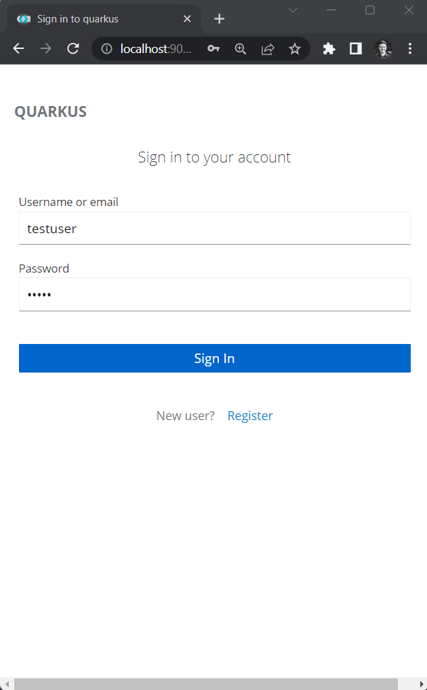
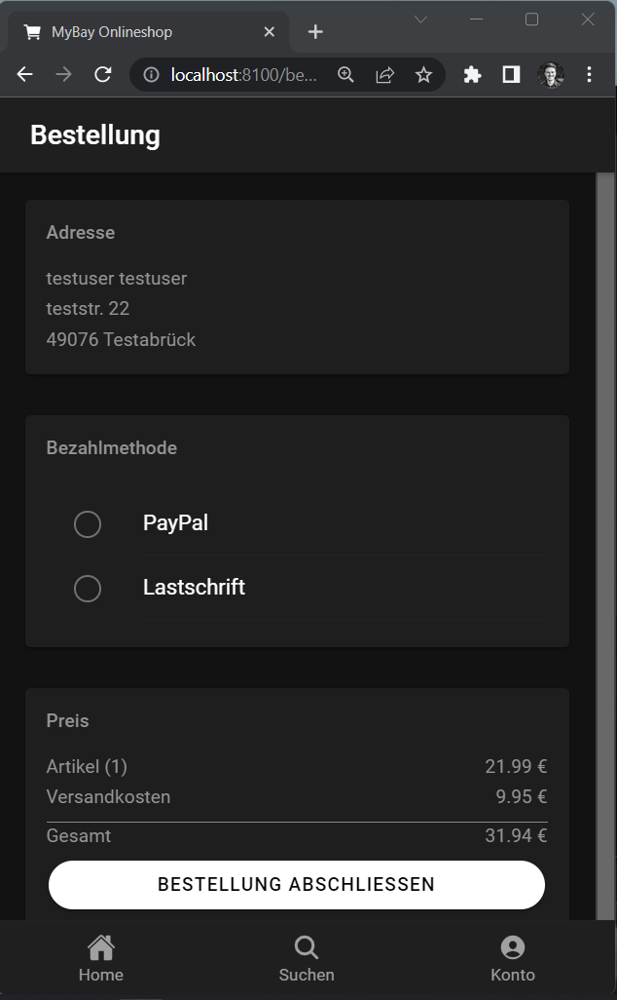
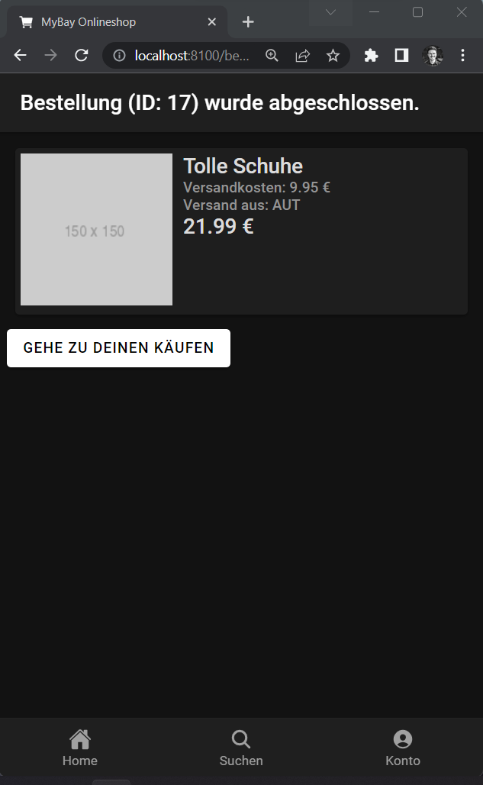
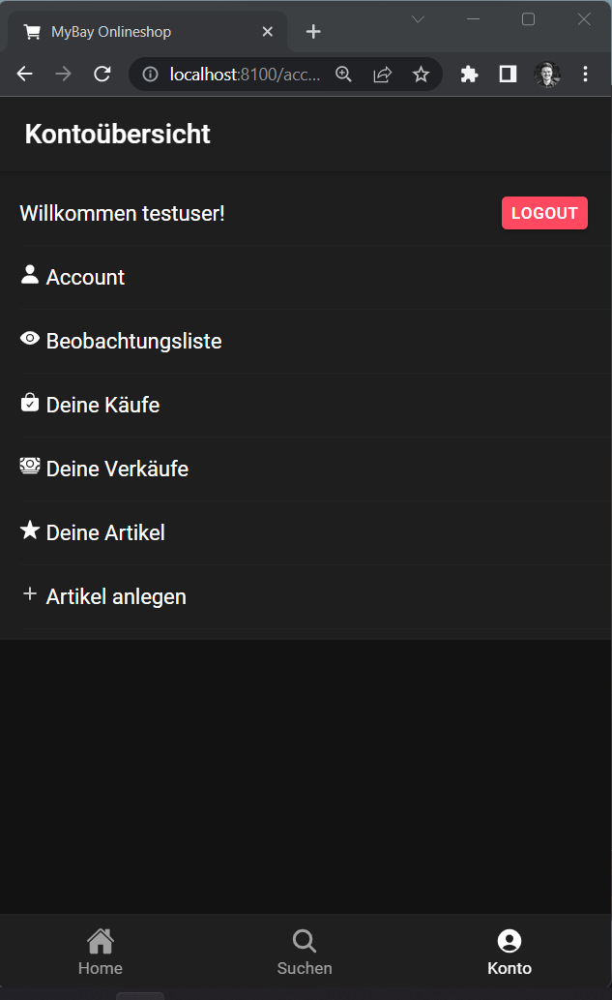
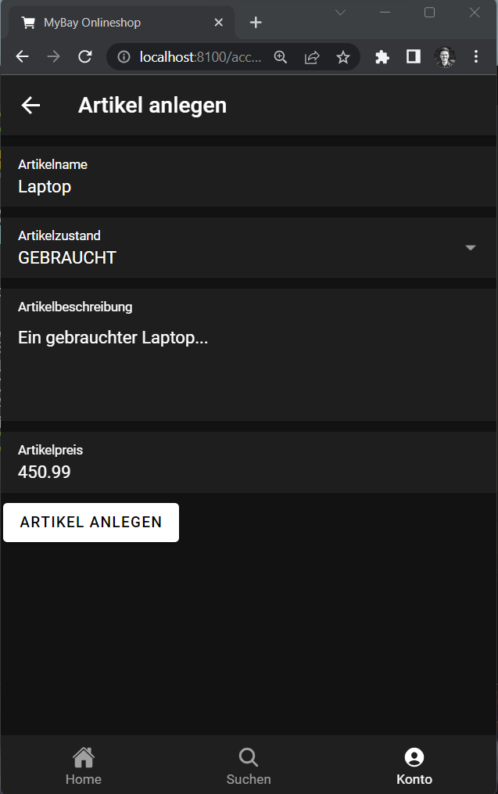
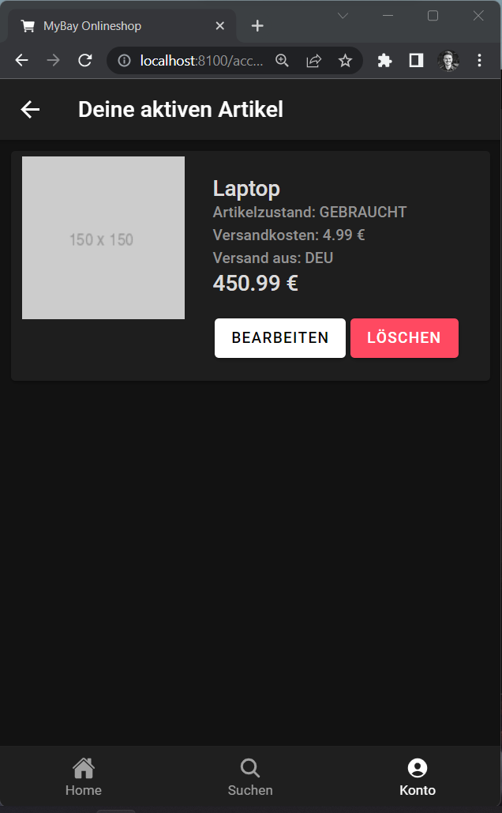
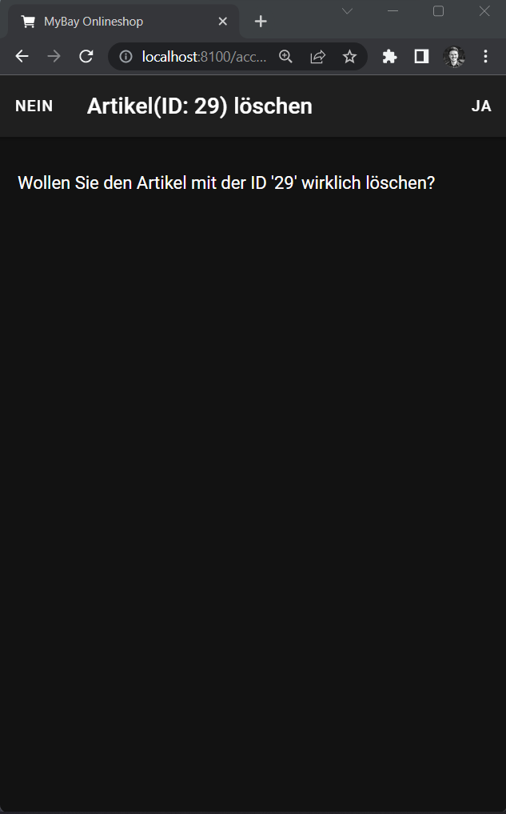
